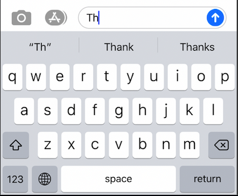

# Autocompletion Project

## Description 

I used binary Search Tree to implement smartphone’s feature that autocompletes words. 

main.cpp -- process command line arguments
	
bst.h 
bst.cpp -- All the operation

tnode.h -- This file is for binary search tree.

Makefile -- use 'make' command to compile the source files and create excutable file called 'run'	

## How to run 

./run text1.txt acronym1.txt 3 flag

text1.txt contains all commonly used words in a dictionary 

acronym1.txt contains prefixes (the beginning of words, or keys) that
will be used to find commonly used words in BST

The integer 3 here means that the prefix length is 3

flag is an integer that can take value 0 or 1 or 2. 
	1. If flag is 0, do not do anything.
    2. If flag is 1, then call heightPrint function and after that print out endl.
    3. if flag is 2, then open the second input file, and while there is input, use each word as a key to find all words that start with this key in BST; i.e. call findPrint function

## Expected Result

## Technologies

- C++
