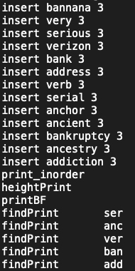
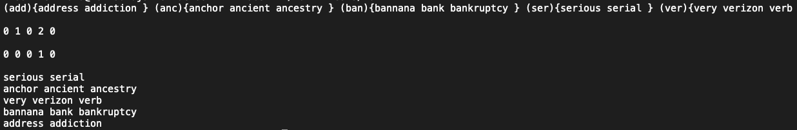

# Autocompletion Project

## Description 

I used Balanced Binary Search Tree to implement smartphone’s feature that autocompletes words. 

Makefile -- use 'make' command to compile these four files and create excutable file called 'run'	

main.cpp 
bst.h 
bst.cpp
tnode.h 

## How to run 

There are six commands user allows to use.
- print_inorder 
- heightPrint
- printBF
- findPrint
- insert
- remove

I created "tests" folder to test the program 

ex)
./run < tests/t01.in > t01.my
diff t01.my tests/t01.out

## Expected Result

## Technologies

- C++
